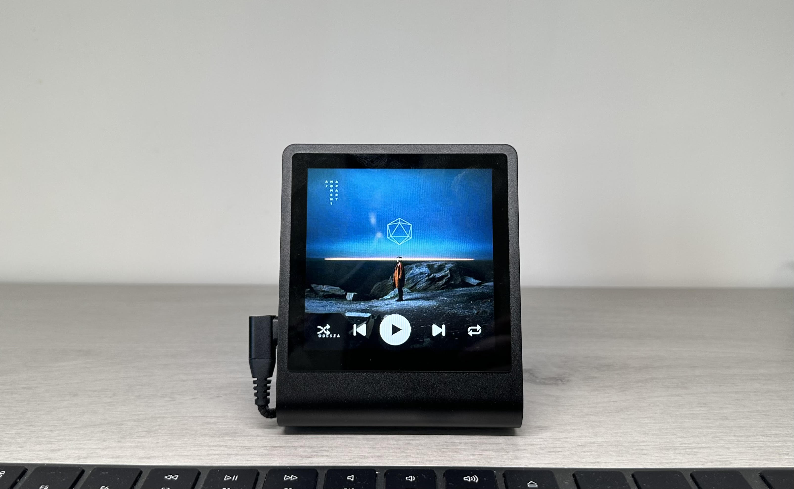

# PrestoDeck



PrestoDeck is a Spotify music controller for the Pimoroni Presto. It displays the album cover art, name, and artist of the currently playing track and provides basic controls for playback.

## Hardware

- [Pimoroni Presto](https://collabs.shop/xbvgb2)
- (Optional) [Right Angle USB C Cable](https://amzn.to/4jUYJ9F) 

## Installation 

Follow these steps to install and set up the project on your Presto. You can also checkout [this YouTube demo/tutorial](https://youtu.be/iOz5XUVkFkY).

### 1. Install Thonny
Download and install Thonny IDE, which you'll use to connect to your Presto and upload the code:
- [Download Thonny](https://thonny.org/)

### 2. Clone the GitHub Repository
Clone the repository to your local machine:
```bash
git clone https://github.com/fatihak/PrestoDeck.git
```

## 3. Create a Spotify App
- Visit [Spotify For Developers](https://developer.spotify.com/dashboard/applications) and Sign In
- In the Developer Dashboard, click "Create an App"
- Give your app a Name and Description
- For the Redirect URIs, enter`http://127.0.0.1:8080`
- Tick the "Web API" box

## 4. Generate Spotify Credentials
- Run the helper script to authenticate and generate your Spotify credentials:

  ```bash
  bash adhoc/generate_token.sh
  ```
    - Note: this requires python3 to be installed on your system
- You'll be prompted to:
    - Enter the Client ID, Client Secret, and Redirect URI for your Spotify App.
    - Visit a URL to authorize your app and paste the redirected URL back.
    - Select a default Spotify device to control playback from PrestoDeck.
- Once complete, copy the generated `SPOTIFY_CREDENTIALS={...}` line and store for the next steps

### 3. Connect your Presto to your computer with a USB-C cable

### 4. Upload Project Files
- Open **Thonny IDE**, and ensure the interpreter is set to **MicroPython (Raspberry Pi Pico)**.
- In the Files window, right clicking on the root of the cloned project in the Files window and selecting 'Upload to /' to copy all the files to the Presto

### 5. Store Wi-Fi and Spotify Credentials
- In Thonny, open the `secrets.py` file.
- Replace the placeholder WIFI credentials with your SSID and password
- Paste the SPOTIFY_CREDENTIALS= line from step #4

### 6. Run the `main.py` Script
- In Thonny, open the `main.py` file.
- Click **Run** to launch the program, and let the beats flow!  

## Additional Resources
- [Pimoroni Presto Github Repo](https://github.com/pimoroni/presto)
- [Getting Started with Pimoroni Presto](https://learn.pimoroni.com/article/getting-started-with-presto)
- [Micropython Spotify Web API](https://github.com/tltx/micropython-spotify-web-api)

## Sponsoring

PrestoDeck is maintained and developed with the help of sponsors. If you enjoy the project or find it useful, consider supporting its continued development.

<p align="center">
<a href="https://github.com/sponsors/fatihak" target="_blank"></a>
<a href="https://www.patreon.com/akzdev" target="_blank"></a>
<a href="https://www.buymeacoffee.com/akzdev" target="_blank"></a>
</p>
